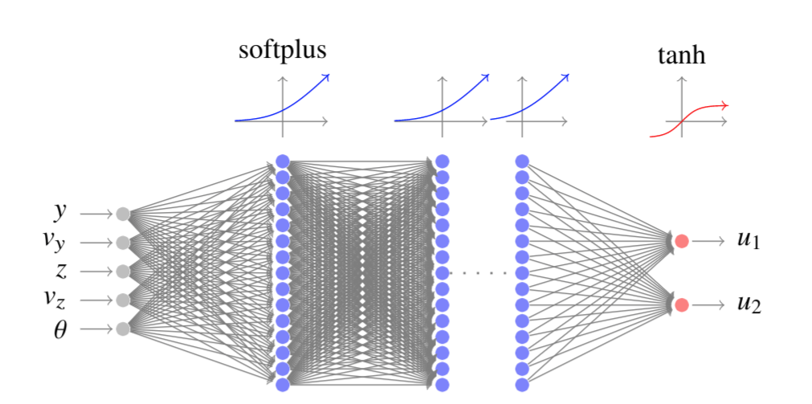
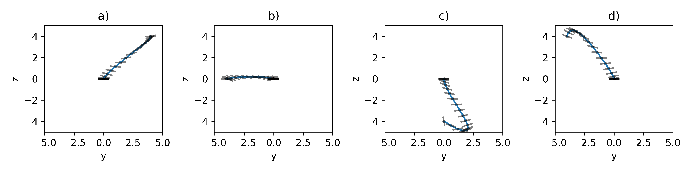
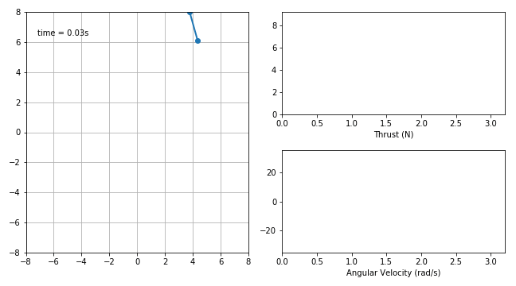
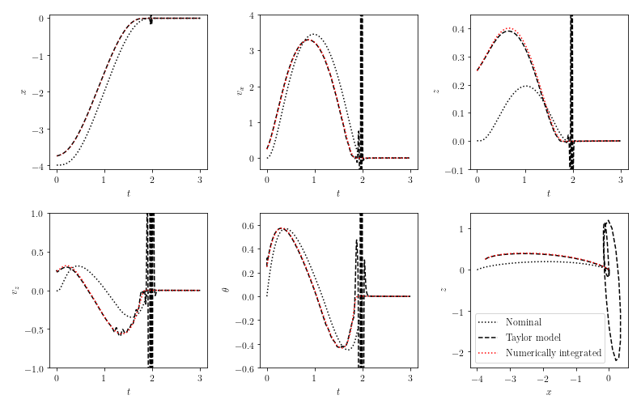

# Stability study of deep networks controlling nonlinear ODEs
This project contains all the python code and pickled network data to reproduce the reuslts in the paper:

Dario Izzo, Dharmesh Tailor and Thomas Vasileiou: "On the stability analysis of optimal state feedbacks as represented by deep neural models"

# Guidance and Control Network (G&CNET)
**Definition:**: A G&CNET (Guidance and Control Network) is a type of neuro controller, in particular a deep, artificial, feed forward neural network trained on state-action pairs representing the optimal control actions, with respect to the performance index:

In other words a G&CNET is a **neural optimal feedback** for a non linear dynamical system.

An example for a GECNET architecture is given below, note the **softplus units** giving continuity properties to the resulting actions.

  

For example a GECNET can perform **real time optimal manouvre on board** of a BEBOP Parrot drone:

  

  

# Stability of G&CNETS Neurocontrollers
These deep neural networks are trained to imitate the optimal response and, in the notebooks here available, are loaded from pickled data. The system dynamics can then be linearized around an equilibrium point (hovering, in the case of a BEBOP drone) using the network gradient information coming from e.g. backpropagation. **Stability and time delayed analysis can thus be performed** and, for example, the root locus for the time delay obtained (and thus a stability margin):

  

# Stability of a G&CNET nominal trajectory
The ODEs describing the neurocontrolled trajectory is then numerically integrated and its result expanded into a high order Taylor map (note that backpropagation cannot be used here as the derivative order is ~7, so differential algebraic techniques are used instead). **The map represents the optimal dynamics close to a nominal trajectory** and can thus be used to study and prove its stability. Convergence radius of the Taylor maps is also studied.

  

